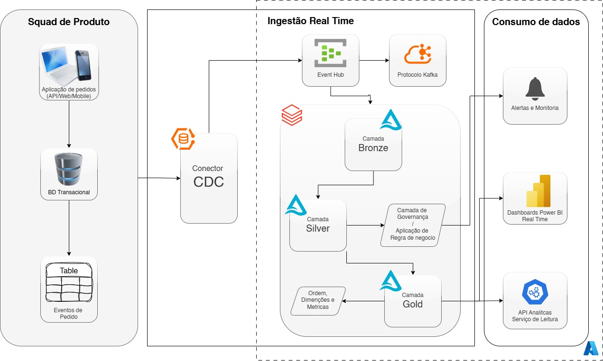

# Arquitetura de Dados em Real Time para Squad de Pedidos
<p align="center">
  
</p>

Este repositório apresenta a solução de dados **near real time** para a squad de pedidos,
usando uma arquitetura **Medalhão (Bronze / Silver / Gold)** em cima de **Azure Event Hubs (Kafka) + Databricks + Delta Lake**.

A proposta faz parte de um case técnico de processo seletivo, com foco em:
- ingestão de eventos de pedidos em tempo real,
- aplicação de governança e regras de negócio,
- disponibilização de métricas e visões analíticas para consumo via ferramentas de analytics.

---

## Visão Geral da Arquitetura

1. **Aplicação de Pedidos + Banco Transacional**
   - A aplicação da squad de produto grava as transações de pedidos em um banco transacional (ex.: Azure SQL / Postgres).
   - Um padrão **Outbox** é utilizado para garantir consistência entre a gravação do pedido e a publicação de eventos de negócio.

2. **Ingestão em Real Time (CDC + Azure Event Hubs com protocolo Kafka)**
   - Um conector **CDC** lê a tabela Outbox do banco transacional.
   - Os eventos são publicados no **Azure Event Hubs** (Kafka enabled), no tópico `sales-transactions-raw`.

3. **Processamento em Databricks (Arquitetura Medalhão + Execução Híbrida)**
   - **Bronze (Streaming contínuo):** ingestão contínua dos eventos a partir do Event Hubs para tabelas Delta.
   - **Silver Governança (Batch – 5 min):** normalização de tipos, regras de qualidade, quarentena de registros inválidos.
   - **Silver Business (Batch – 5 min):** aplicação de regras de negócio (ex.: cálculo de `line_total`, filtros de clientes de teste).
   - **Gold (Batch – 15 min):** construção de dimensões, fato de vendas e métricas agregadas para consumo analítico.

4. **Camada de Consumo**
   - Tabelas Gold são consumidas por:
     - **Power BI** (dashboards operacionais e analíticos).
     - **APIs analíticas**, permitindo integração com outros sistemas.

---

## Tecnologias Utilizadas

- **Azure Event Hubs (Kafka endpoint)** – mensageria em real time.
- **Databricks + Apache Spark (PySpark)** – processamento em streaming e batch.
- **Delta Lake** – armazenamento transacional nas camadas Bronze, Silver e Gold.
- **Python / PySpark** – desenvolvimento dos notebooks.
- **Power BI** – dashboards e relatórios analíticos.

---

## Modelo de Dados em Streaming

A tabela de streaming utilizada representa itens de transações de venda:

```text
TransactionNo | Date       | ProductNo | ProductName             | Price | Quantity | CustomerNo | Country
------------- | ---------- | --------- | ------------------------| ----- | -------- | ---------- | --------------
581482        | 12/9/2019  | 22485     | Set Of 2 Wooden M...    | 21.47 | 12       | 17490      | United Kingdom
...

